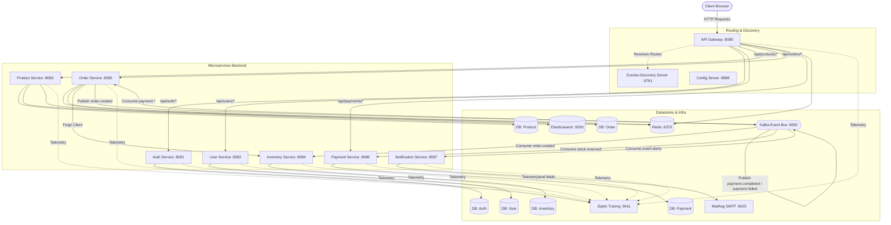

# 🛍️ Luxury-E_Com (LVMH Project)

A production-grade, premium e-commerce platform built with a high-performance **React + TypeScript + Vite** frontend and a robust **Java 17 + Spring Boot 3.x** microservices backend.

---

## 🏗️ System Design & Architecture

This application follows a decentralized **Microservices Architecture** with a **Database-per-Service** pattern, centralized routing, distributed tracing, and event-driven choreography for transaction management.

### Architecture Diagram



### Backend Microservices Core Components

| Service | Port | Description |
| :--- | :--- | :--- |
| **API Gateway** | `8080` | Handles entry routing, JWT verification, and rate limiting using Spring Cloud Gateway and Redis. |
| **Auth Service** | `8081` | Manages user registration, login, JWT token issuance, and refresh token cycles. |
| **User Service** | `8082` | Handles customer profiles, billing, and shipping address management. |
| **Product Service** | `8083` | Catalogs luxury goods. Performs high-speed searching using Elasticsearch and caches product details using Redis. |
| **Inventory Service** | `8084` | Manages stock allocation and participates in checkout Saga transactions. |
| **Order Service** | `8085` | Handles order state, checkout workflow, shopping carts, and orchestrates Saga events. |
| **Payment Service** | `8086` | Simulates payment capture and processes virtual checkout transactions (Pay on Delivery). |
| **Notification Service** | `8087` | Listens to Kafka event topics and sends email confirmations to users. |
| **Config Server** | `8888` | Central repository for external configurations. |
| **Discovery Server** | `8761` | Eureka Server for service registration and dynamic resolution. |

### Architectural Patterns & Mechanisms

- **Event-Driven Choreography (Saga Pattern)**: To manage distributed transactions across the order placement, inventory reservation, and payment processing steps without blocking threads. Communications are handled asynchronously via **Apache Kafka**.
- **Database-per-Service**: Promotes service autonomy. Each service has its own dedicated **PostgreSQL** schema to prevent coupling.
- **API Gateway Routing**: The Gateway acts as the single point of entry, routing requests to services dynamically discovered via **Netflix Eureka**.
- **Distributed Tracing**: Outfitted with **Zipkin** to monitor service latency and trace request flows across the microservices ecosystem.
- **Search Optimization**: Uses **Elasticsearch** for fuzzy, full-text product search capability.
- **Caching**: **Redis** is utilized for storing user shopping carts, caching high-traffic product listings, and API rate limiting.

---

## ✨ Premium Features & Enhancements

We implemented a collection of premium UX enhancements and core platform upgrades:

### 1. Curated Wishlist Registry 🖤
- Added interactive heart toggle buttons to all product cards and product detail views.
- Included a dedicated luxury Wishlist drawer with options to "Move to Cart" or "Remove", persistent across sessions via `localStorage`.

### 2. Recently Viewed Products 🕰️
- Tracks the last 6 products browsed in detail.
- Displayed as a premium horizontal scroll strip at the bottom of the catalog page, creating an immersive browsing loop.

### 3. Animated Toast System 🍞
- Replaces raw browser `alert()` popups with custom-designed context-based toast notifications (Gold/Success, Amber/Warning, Indigo/Info, Red/Error) matching the premium LVMH aesthetic.

### 4. Theme Preference Persistence 🌗
- Saves light/dark mode choices to `localStorage` to survive page reloads and maintain the client's preferred styling.

### 5. Architectural & Stability Fixes 🛠️
- **Order Notes Serialization**: Resolved a bug where delivery instructions/notes were missing from order responses, mapping them correctly from the PostgreSQL model to the `OrderResponse` DTO.
- **Race Condition Mitigated**: Added asynchronous synchronization on cart actions (resolved missing `await` on `clearCart()`).
- **Stable Hook Closures**: Wrapped async cart syncing methods in `useCallback` to clean up lint closures.

---

## 🚀 Instructions for Starting the Web Application

Follow these steps to run both the backend microservices and frontend web server locally.

### Prerequisites

Make sure you have the following installed:
- **Java 17** or higher
- **Maven 3.9+**
- **Node.js** (v18.x or higher) and `npm`
- **Docker** and **Docker Compose**

---

### Step 1: Clone and Set Up Environments

Create a `.env` file inside the [`Backend`](file:///c:/Users/athar/OneDrive/Desktop/LVMH/Backend) directory to set the secret keys:

```bash
# Navigate to backend directory
cd Backend

# Create a .env file (or add these keys to your environment)
JWT_SECRET=404E635266556A586E3272357538782F413F4428472B4B6250645367566B5970
```

---

### Step 2: Build the Backend Services

From the [`Backend`](file:///c:/Users/athar/OneDrive/Desktop/LVMH/Backend) folder, compile and bundle the microservice modules using Maven:

```bash
mvn clean package -DskipTests
```

---

### Step 3: Start Databases & Core Infrastructure

Launch all databases (Postgres, Redis, Elasticsearch, Kafka, Zipkin, etc.) and Spring Boot services defined in the configuration using Docker Compose:

```bash
docker-compose up -d
```

Check that the containers are healthy by running:
```bash
docker-compose ps
```

---

### Step 4: Start the Frontend Application

1. Open a new terminal session and navigate to the [`Frontend`](file:///c:/Users/athar/OneDrive/Desktop/LVMH/Frontend) directory:
   ```bash
   cd Frontend
   ```
2. Install the necessary node dependencies:
   ```bash
   npm install
   ```
3. Launch the Vite development server:
   ```bash
   npm run dev
   ```
4. Access the web application at **[http://localhost:5173](http://localhost:5173)**.

---

## 📊 Management & Monitoring Dashboards

Once everything is started, you can access these monitoring endpoints:

- **Service Registry (Eureka)**: [http://localhost:8761](http://localhost:8761)
- **API Gateway Endpoint**: [http://localhost:8080](http://localhost:8080)
- **Distributed Traces (Zipkin)**: [http://localhost:9411](http://localhost:9411)
- **Mock Mail Client (Mailhog)**: [http://localhost:8025](http://localhost:8025)
- **Swagger Documentation**:
  - Auth: [http://localhost:8081/swagger-ui.html](http://localhost:8081/swagger-ui.html)
  - User: [http://localhost:8082/swagger-ui.html](http://localhost:8082/swagger-ui.html)
  - Product: [http://localhost:8083/swagger-ui.html](http://localhost:8083/swagger-ui.html)
  - Inventory: [http://localhost:8084/swagger-ui.html](http://localhost:8084/swagger-ui.html)
  - Order: [http://localhost:8085/swagger-ui.html](http://localhost:8085/swagger-ui.html)
  - Payment: [http://localhost:8086/swagger-ui.html](http://localhost:8086/swagger-ui.html)


